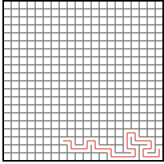

Maze Builder
============

Inspired by http://mazeworks.com/mazegen/mazetut/index.htm (via HN) I wanted to create a visualization around buliding mazes with depth first search.  I also wanted an excuse to play with a few libraries I've had interest in trying out, namely [mori](https://github.com/swannodette/mori) and [react](http://facebook.github.io/react/) but also [coffeescript](http://coffeescript.org/) and [gulp.js](http://gulpjs.com/).

A one level deep tree is used to minimize the work react has to do to determine which parts of the maze needs to be updated.  Initially this was totally flat and a grid size of 60x20 would take ~200ms to update.  With a single level it is down to ~20ms.  Next I'd like to generalize this tree structure as well as allow further nesting.  Performance still suffers as you make the grid larger but further nesting would fix this.